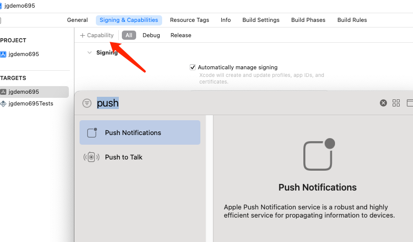

# 此例子为了使新手少走弯路，ios/android 均测试通过，RN环境0.69.5，官方地址： https://github.com/jpush/jpush-react-native/tree/master
    这里只讲述了本地消息推送，远程消息推送查看官方api：https://docs.jiguang.cn/jpush/client/client_plugins
# ios 集成步骤
- 安装依赖
```
yarn add jpush-react-native 
yarn add jcore-react-native
```
- 安装完成后无需link
 ```
cd ios && pod install
```
- 用Xcode打开ios目录，添加jpush需要的代码 

- 1、修改 AppDelegate.h
```
#import <RCTJPushModule.h>
#import <UserNotifications/UserNotifications.h>
@interface AppDelegate : UIResponder <UIApplicationDelegate, RCTBridgeDelegate, JPUSHRegisterDelegate>

```

- 2、修改 AppDelegate.mm,代码存放位置可以直接查看demo
```
#import <RCTJPushModule.h>

 JPUSHRegisterEntity * entity = [[JPUSHRegisterEntity alloc] init];
    if (@available(iOS 12.0, *)) {
      entity.types = JPAuthorizationOptionNone;
    }
    [JPUSHService registerForRemoteNotificationConfig:entity delegate:self];
    
    //************************************************JPush start************************************************

//注册 APNS 成功并上报 DeviceToken
- (void)application:(UIApplication *)application didRegisterForRemoteNotificationsWithDeviceToken:(NSData *)deviceToken {
  [JPUSHService registerDeviceToken:deviceToken];
}

//iOS 7 APNS
- (void)application:(UIApplication *)application didReceiveRemoteNotification:  (NSDictionary *)userInfo fetchCompletionHandler:(void (^)(UIBackgroundFetchResult))completionHandler {
  // iOS 10 以下 Required
  NSLog(@"iOS 7 APNS");
  [JPUSHService handleRemoteNotification:userInfo];
  [[NSNotificationCenter defaultCenter] postNotificationName:J_APNS_NOTIFICATION_ARRIVED_EVENT object:userInfo];
  completionHandler(UIBackgroundFetchResultNewData);
}

//iOS 10 前台收到消息
- (void)jpushNotificationCenter:(UNUserNotificationCenter *)center  willPresentNotification:(UNNotification *)notification withCompletionHandler:(void (^)(NSInteger))completionHandler {
  NSDictionary * userInfo = notification.request.content.userInfo;
  if([notification.request.trigger isKindOfClass:[UNPushNotificationTrigger class]]) {
    // Apns
    NSLog(@"iOS 10 APNS 前台收到消息");
    [JPUSHService handleRemoteNotification:userInfo];
    [[NSNotificationCenter defaultCenter] postNotificationName:J_APNS_NOTIFICATION_ARRIVED_EVENT object:userInfo];
  }
  else {
    // 本地通知 todo
    NSLog(@"iOS 10 本地通知 前台收到消息");
    [[NSNotificationCenter defaultCenter] postNotificationName:J_LOCAL_NOTIFICATION_ARRIVED_EVENT object:userInfo];
  }
  //需要执行这个方法，选择是否提醒用户，有 Badge、Sound、Alert 三种类型可以选择设置
  completionHandler(UNNotificationPresentationOptionAlert);
}

//iOS 10 消息事件回调
- (void)jpushNotificationCenter:(UNUserNotificationCenter *)center didReceiveNotificationResponse:(UNNotificationResponse *)response withCompletionHandler: (void (^)(void))completionHandler {
  NSDictionary * userInfo = response.notification.request.content.userInfo;
  if([response.notification.request.trigger isKindOfClass:[UNPushNotificationTrigger class]]) {
    // Apns
    NSLog(@"iOS 10 APNS 消息事件回调");
    [JPUSHService handleRemoteNotification:userInfo];
    // 保障应用被杀死状态下，用户点击推送消息，打开app后可以收到点击通知事件
    [[RCTJPushEventQueue sharedInstance]._notificationQueue insertObject:userInfo atIndex:0];
    [[NSNotificationCenter defaultCenter] postNotificationName:J_APNS_NOTIFICATION_OPENED_EVENT object:userInfo];
  }
  else {
    // 本地通知
    NSLog(@"iOS 10 本地通知 消息事件回调");
    // 保障应用被杀死状态下，用户点击推送消息，打开app后可以收到点击通知事件
    [[RCTJPushEventQueue sharedInstance]._localNotificationQueue insertObject:userInfo atIndex:0];
    [[NSNotificationCenter defaultCenter] postNotificationName:J_LOCAL_NOTIFICATION_OPENED_EVENT object:userInfo];
  }
  // 系统要求执行这个方法
  completionHandler();
}

//自定义消息
- (void)networkDidReceiveMessage:(NSNotification *)notification {
  NSDictionary * userInfo = [notification userInfo];
  [[NSNotificationCenter defaultCenter] postNotificationName:J_CUSTOM_NOTIFICATION_EVENT object:userInfo];
}

//************************************************JPush end************************************************

  ```
- 添加通知


推荐使用真机测试，参考例子App.js或看官方

# Android 配置
